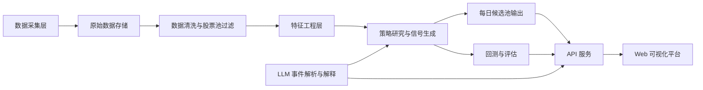

# A股AI选股工具开发方案 V2

## 1. 项目定位

本方案将原始设想重构为一套更适合个人开发者或小团队落地的 A 股 AI 选股研究平台。核心原则不是追求“全能 AI 自动交易”，而是优先构建一套：

- 数据可持续获取
- 信号可回测验证
- 输出可解释
- 风险可控制
- 后续可逐步扩展到更高频和更复杂策略

系统第一阶段定位为：

- 盘后研究型选股系统
- 次日交易辅助决策系统
- 以日频和分钟级补充特征为主
- 以研究、筛选、解释、回测为核心

不建议在第一阶段直接定位为：

- 全自动实盘系统
- 免费数据驱动的涨停接力系统
- 强依赖盘口细节的超短线系统

## 2. V2 目标边界

### 2.1 第一阶段目标

在 4 到 8 周内完成一个可运行的 MVP，支持以下能力：

- 每日自动更新 A 股基础行情、指数、行业和新闻数据
- 自动完成股票池清洗和特征计算
- 输出每日候选股票列表和选股理由
- 完成历史回测、分层评估和因子有效性验证
- 提供一个轻量化 Web 页面查看信号、板块和个股解释

### 2.2 非目标

第一阶段不强求实现以下内容：

- 高频盘口交易
- Level-2 级别深度盘口建模
- 自动下单
- 端到端深度学习选股大模型
- 纯 LLM 驱动的买卖决策

## 3. 核心设计原则

### 3.1 LLM 只做增强，不做主决策

LLM 适合做：

- 新闻摘要
- 政策解读
- 事件抽取
- 个股关联提示
- 结果解释

LLM 不应在第一阶段直接承担：

- 个股打分主模型
- 最终买卖决策器
- 无约束的公司映射和情绪评分

主交易信号仍然应基于结构化因子、规则和可回测模型。

### 3.2 先日频后分钟级，先研究后执行

先把日频体系做扎实，再逐步增加分钟级辅助特征。这样能显著降低数据质量和回测复杂度风险。

### 3.3 多源冗余，单源可替换

免费数据可以作为起点，但系统必须设计成“数据源可替换”的模式，不能把业务逻辑耦合在单一接口上。

## 4. 建议的 V2 系统架构



## 5. 模块拆分

### 5.1 数据采集层

建议拆成以下适配器：

- `market_data_adapter`
  - 日线行情
  - 分钟级行情
  - 指数行情
  - 行业指数或行业 ETF
- `fund_flow_adapter`
  - 北向资金
  - 板块资金
  - 个股资金类公开指标
- `basic_info_adapter`
  - 股票基础信息
  - 上市日期
  - ST 状态
  - 停牌状态
- `news_adapter`
  - 财经快讯
  - 监管公告
  - 上市公司公告摘要

建议保留统一接口：

- `fetch(symbol, start, end, granularity)`
- `normalize()`
- `validate()`

这样未来替换数据源时，只需更换 adapter。

### 5.2 数据存储层

MVP 不建议一上来使用复杂的大型 OLAP 或分布式系统，推荐：

- 原始数据：`Parquet`
- 研究查询：`DuckDB`
- 在线应用元数据：`PostgreSQL`
- 缓存：`Redis`

建议目录结构：

- `data/raw/`
- `data/processed/`
- `data/features/`
- `data/backtest/`

### 5.3 数据清洗与股票池过滤

每日生成可交易股票池，至少过滤：

- ST 和 *ST
- 上市未满 120 个交易日
- 长期停牌
- 流动性过低
- 一字涨停或连续无法成交样本
- 财务异常样本

建议增加流动性门槛：

- 近 20 日平均成交额大于某阈值
- 近 20 日换手率中位数大于某阈值

### 5.4 特征工程层

第一阶段以结构化特征为主，不建议主打“图像识别型 K 线形态”。

建议特征分组如下：

#### 价格趋势特征

- 5/10/20/60 日收益率
- 相对行业超额收益
- 相对沪深 300 超额收益
- 均线斜率
- 均线多头排列得分

#### 波动与收缩特征

- ATR
- 历史波动率
- 振幅
- 波动收缩率
- 突破前压缩程度

#### 成交与换手特征

- 成交额均值和变化率
- 放量倍数
- 换手率
- 换手分位数

#### 质量与风险过滤特征

- 最近涨跌停次数
- 连板数
- 开板次数
- 极端波动标签

#### 板块和行业特征

- 行业动量得分
- 行业资金一致性
- 行业内个股强度排序
- 板块热度

#### 文本事件特征

- 事件类型
- 利好/利空方向
- 影响范围
- 事件时效性
- 关联公司置信度

### 5.5 策略研究与信号层

V2 推荐将策略拆成三层，而不是三套互相独立的“并发 AI”：

#### 第一层：市场环境过滤

作用是决定是否激活进攻策略以及风险预算。

建议信号：

- 大盘趋势过滤
- 宽基指数风险状态
- 行业轮动强度
- 北向资金和市场广度

输出结果：

- `risk_on`
- `neutral`
- `risk_off`

#### 第二层：候选池排序模型

这是主策略层，负责对个股做横截面排序。

建议优先方案：

- 基线版：规则打分
- 进阶版：逻辑回归 / LightGBM / XGBoost

预测目标建议简单明确：

- 未来 3 个交易日超额收益排名
- 未来 5 个交易日超额收益排名
- 未来 1 日上涨概率

不要一开始把标签设计得过于复杂。

#### 第三层：事件增强与解释

LLM 在这一层发挥作用：

- 提取新闻事件摘要
- 判断事件是否具备持续性
- 生成“为什么入选”的解释
- 作为排序结果的加减分项，而不是唯一依据

### 5.6 风控层

原方案只写 ATR 止损，V2 需要扩展到组合层。

建议风控拆成四层：

- 个股层
  - ATR 止损
  - 最大单票仓位
  - 流动性约束
- 组合层
  - 行业集中度上限
  - 单日最大新开仓数
  - 总仓位上限
- 市场层
  - `risk_off` 降低总仓位
  - 指数破位减仓
- 执行层
  - 涨停无法买入
  - 跌停无法卖出
  - 开盘跳空滑点

## 6. 不建议作为第一阶段主线的部分

### 6.1 “AI 图表模式匹配”

这部分可以保留为研究专题，但不建议作为系统主策略。原因：

- 容易描述得很强，实际难以稳定验证
- 样本切分和标签设计稍有不慎就会产生未来函数
- 与结构化因子相比，可解释性和复现性更弱

如果要做，建议作为附加特征：

- 双底突破标签
- 平台突破标签
- 缩量回踩标签

用规则提取代替“黑箱图像 AI”会更稳。

### 6.2 “涨停接力主策略”

这类策略对数据质量和执行约束要求极高。若使用免费或半结构化数据，容易出现：

- 首次涨停时间不准
- 封单额不可稳定回放
- 回测成交假设失真
- 实盘可买性远差于回测结果

建议替代为：

- 强势股延续
- 高换手龙头次日强弱分化
- 行业内最强股排序

这仍保留 A 股特色，但对数据要求更低。

## 7. 回测框架设计

这是原方案最需要补强的地方。

### 7.1 回测原则

必须支持：

- 前复权或后复权一致性
- 交易日历对齐
- 停牌处理
- 涨跌停处理
- T+1 约束
- 手续费和滑点
- 未来函数检查
- 训练集和测试集时间切分

### 7.2 回测模式

建议做两类回测：

- 截面选股回测
  - 每日收盘后生成候选池
  - 次日开盘或均价买入
  - 持有 3 到 5 日
- 市场状态回测
  - 验证 `risk_on/risk_off` 是否确实改善回撤

### 7.3 评估指标

至少输出：

- 年化收益
- 最大回撤
- 夏普比率
- 卡玛比率
- 胜率
- 盈亏比
- 换手率
- 持仓集中度
- 行业暴露
- 每笔交易分布

### 7.4 Walk-forward 验证

推荐按时间滚动验证：

- 训练窗口：24 个月
- 验证窗口：6 个月
- 测试窗口：6 个月

避免一次性全历史训练后直接报告结果。

## 8. 数据表设计

### 8.1 `dim_security`

字段建议：

- `symbol`
- `name`
- `list_date`
- `exchange`
- `industry_code`
- `industry_name`
- `is_st`
- `is_active`

### 8.2 `fact_daily_bar`

字段建议：

- `trade_date`
- `symbol`
- `open`
- `high`
- `low`
- `close`
- `pre_close`
- `volume`
- `amount`
- `turnover_rate`
- `adj_factor`
- `is_limit_up`
- `is_limit_down`
- `is_suspended`

主键建议：

- `(trade_date, symbol)`

### 8.3 `fact_minute_bar`

字段建议：

- `trade_datetime`
- `symbol`
- `open`
- `high`
- `low`
- `close`
- `volume`
- `amount`

### 8.4 `fact_sector_daily`

字段建议：

- `trade_date`
- `sector_code`
- `sector_name`
- `open`
- `high`
- `low`
- `close`
- `volume`
- `amount`
- `sector_strength_score`

### 8.5 `fact_news_event`

字段建议：

- `event_id`
- `publish_time`
- `source`
- `title`
- `content`
- `event_type`
- `event_sentiment`
- `impact_level`
- `time_decay_score`
- `llm_summary`

### 8.6 `bridge_event_security`

字段建议：

- `event_id`
- `symbol`
- `relevance_score`
- `mapping_reason`
- `mapping_confidence`

### 8.7 `fact_feature_snapshot`

字段建议：

- `trade_date`
- `symbol`
- `feature_json`
- `model_version`
- `label_window`

如果后期需要高性能训练，也可以把特征拍平成宽表。

### 8.8 `fact_signal_output`

字段建议：

- `trade_date`
- `symbol`
- `strategy_version`
- `base_score`
- `event_score`
- `risk_adjusted_score`
- `rank`
- `selected_flag`
- `reason_text`

## 9. 模型与规则建议

### 9.1 第一阶段推荐模型组合

- 市场环境：规则打分
- 行业轮动：动量 + 均线 + 资金一致性打分
- 个股排序：LightGBM 或逻辑回归
- 事件模块：LLM 事件抽取 + 规则校验

### 9.2 信号融合方式

推荐公式化融合，先不要搞复杂元学习：

`final_score = market_gate * (0.6 * cross_section_score + 0.25 * sector_score + 0.15 * event_score)`

其中：

- `market_gate` 取值可为 `0 / 0.5 / 1`
- `event_score` 必须设置上限，避免 LLM 信息放大过度

### 9.3 事件模块的安全约束

LLM 输出进入策略前，需要经过以下校验：

- 公司代码映射校验
- 事件时间有效性校验
- 来源可信度校验
- 重复新闻去重
- 过度泛化新闻剔除

## 10. API 与前端建议

### 10.1 后端

推荐技术栈：

- `FastAPI`
- `Pydantic`
- `SQLAlchemy`
- `DuckDB`
- `PostgreSQL`
- `Celery` 或 `APScheduler`

推荐接口：

- `GET /api/market/regime`
- `GET /api/sectors/top`
- `GET /api/signals/daily`
- `GET /api/stocks/{symbol}`
- `GET /api/backtest/summary`
- `GET /api/backtest/trades`
- `GET /api/news/events`

### 10.2 前端

推荐技术栈：

- `React`
- `Vite`
- `ECharts`
- `Ant Design` 或轻量组件库

建议页面：

- 首页总览
  - 市场状态
  - 今日建议仓位
  - 前五行业
- 候选池页面
  - 每日入选股票
  - 排名分数
  - 入选原因
- 个股详情页
  - K 线
  - 因子得分
  - 事件摘要
  - 所属板块
- 回测页
  - 净值曲线
  - 回撤曲线
  - 分组收益

## 11. 开发目录建议

```text
project/
  backend/
    app/
      api/
      core/
      models/
      services/
      tasks/
      schemas/
  frontend/
    src/
      pages/
      components/
      services/
  data_pipeline/
    adapters/
    jobs/
    validators/
    features/
  research/
    notebooks/
    backtest/
    experiments/
  data/
    raw/
    processed/
    features/
  docs/
```

## 12. 4 到 8 周开发里程碑

### 第 1 周：数据基础设施

- 完成项目结构初始化
- 接入基础日线和指数数据
- 建立股票池过滤规则
- 完成原始数据落盘和数据校验

交付结果：

- 可每日更新基础行情
- 可生成标准股票池

### 第 2 周：特征工程与行业轮动

- 计算价格、波动、换手和行业特征
- 完成行业强度打分
- 输出每日前五强行业

交付结果：

- 有一版可解释的市场环境与行业过滤器

### 第 3 周：基线选股策略

- 建立规则打分版横截面排序
- 生成候选池
- 输出选股理由模板

交付结果：

- 每日可得到 10 到 30 只候选股

### 第 4 周：回测引擎

- 实现持仓模拟
- 补充交易成本和 T+1 约束
- 输出净值和回撤曲线

交付结果：

- 能验证基线策略是否具备研究价值

### 第 5 周：LLM 事件模块

- 接入新闻抓取
- 实现事件抽取和摘要
- 通过规则校验后写入事件表

交付结果：

- 每日候选股可附带文本解释和事件增强

### 第 6 周：前后端联调

- 完成 API 封装
- 搭建 Web 看板
- 打通候选池、个股详情和回测结果展示

交付结果：

- 一个可演示、可研究使用的 MVP

### 第 7 到 8 周：优化与扩展

- 增加 LightGBM 排序模型
- 做 walk-forward 验证
- 引入分钟级辅助特征
- 完善组合风控

交付结果：

- 从研究型原型升级到可持续迭代的平台

## 13. MVP 验收标准

满足以下条件即可认为第一阶段成功：

- 数据可连续稳定更新 10 个交易日以上
- 每日候选池可自动生成
- 回测结果可复现
- 能明确看到市场状态过滤对回撤的改善
- Web 页面能展示候选股、行业和解释信息
- LLM 输出经校验后可稳定入库

## 14. 风险与应对

### 14.1 数据风险

风险：

- 免费接口变更
- 抓取失败
- 历史数据缺失

应对：

- 多源适配
- 失败重试
- 本地缓存
- 数据质量日报

### 14.2 模型风险

风险：

- 过拟合
- 未来函数
- 牛市有效、震荡市失效

应对：

- 时间滚动验证
- 简化标签
- 保留规则基线
- 不以单段行情证明模型有效

### 14.3 实盘风险

风险：

- 涨停买不到
- 跌停卖不出
- 滑点偏大
- 新闻反应过度

应对：

- 第一阶段只做辅助决策
- 回测中从严假设成交
- 对短线策略设置更高流动性门槛

## 15. 最终推荐路线

最建议采用的 V2 路线是：

- 用结构化因子和横截面排序构建主选股能力
- 用市场环境和行业轮动做上层过滤
- 用 LLM 做事件增强和解释
- 用回测框架作为系统可信度核心
- 用 Web 看板承载研究和展示

一句话概括：

先做“可验证的 AI 研究平台”，再逐步演进成“更强的交易辅助系统”。

